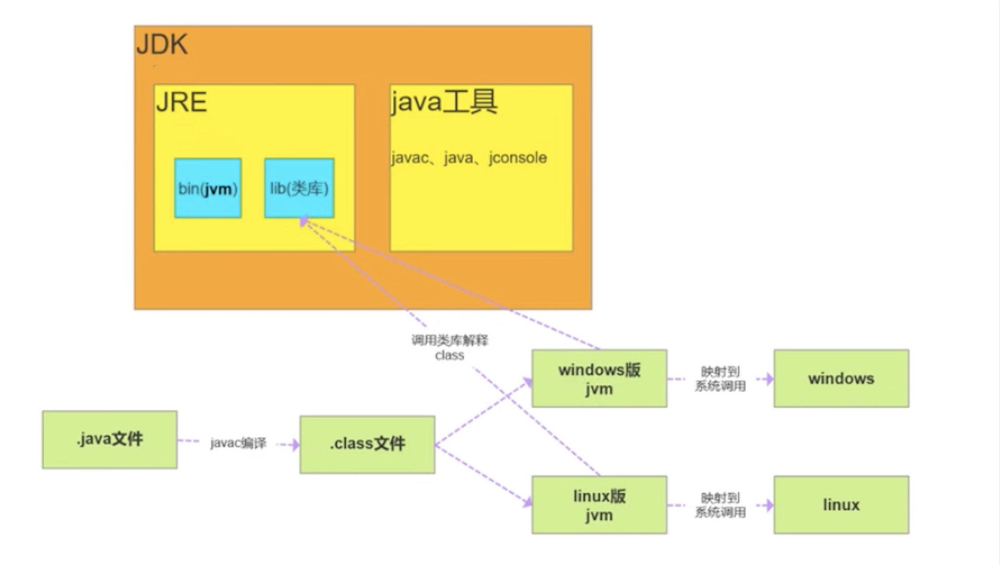
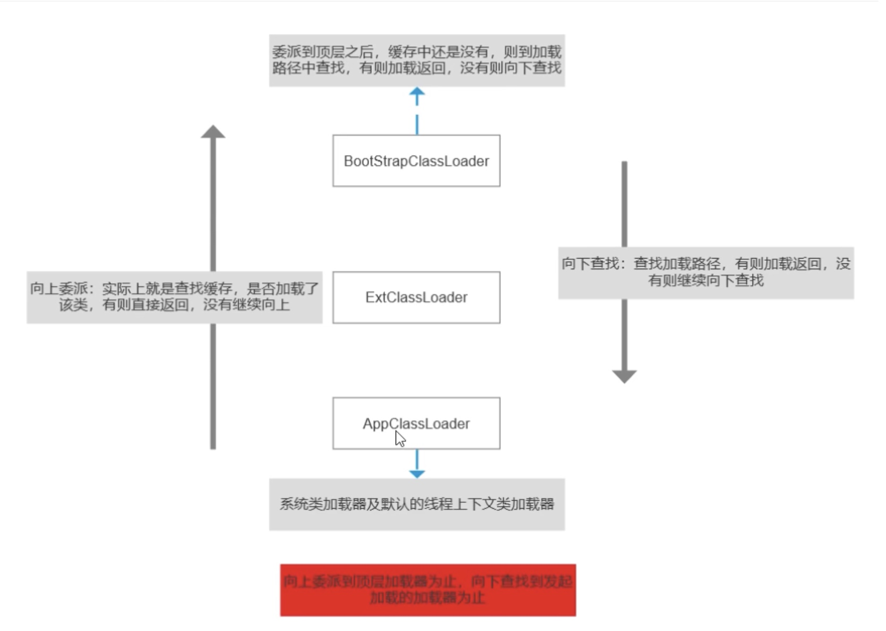

# 面试
## 面向对象
* 面向过程
函数，更注重步骤和顺序
直接高效
* 面向对象
注重参与者以及参与者的职责
容易复用
封装继承以及多态
### 封装
将数据项以及成员函数向外界标识，使用者不知道内部具体实现逻辑
### 继承
子类可以直接使用父类的函数
### 多态
主要用于接口，不同类可实现同一接口，使用相同的函数达到不同的功能。
**若是该方法为子类特有的，通过new父接口是无法使用的**
```java
public interface Parent(){
	int get0();
}
public class Son implements Parent{
	@overview
	public int get0(){
		return 0;
	}
	public int get1(){
		return 1;
	}
}
Parent test = new Son();
// error
test.get1();
```
## JDK JRE JVM
JDK：Java开发工具，JRE：Java运行时环境，JVM：Java虚拟机
JDK中有JRE，JRE中有JVM，如下图所示：


## ==和equal
* ==：对比栈中的值，基本数据类型比变量值，引用对象比地址值
* equal：对象中默认也用==比较，但一般会被重写，String类中的方法是通过字符的逐个比较
```java
public class Main {
    public static void main(String[] args) {
        String str1 = "Hello";
        String str2 = new String("Hello");
        String str3 = str2; //引用传递
        System.out.println(str1 == str2);   //  false
        System.out.println(str1 == str3);   //  false
        System.out.println(str2 == str3);   //  true
        System.out.println(str1.equals(str2));  //  true
        System.out.println(str1.equals(str3));  //  true
        System.out.println(str2.equals(str3));  //  true
    }
}
```
## final
修饰类：无法被继承；
修饰方法：不可被子类重写但可被重载；
修饰变量：赋值后不可被更改-->声明时或者代码块中赋值（使用前必须显式赋值）；
修饰基本数据类型：数值初始化后无法被更改；
修饰引用类型：对其初始化后不能再让其指向另一个对象，但**引用的值是可变的**
```java
public class Main {
    final static int a = 0; //  声明时就需要赋值
    /*
    static{
        a = 0;
     }
    */
    final int b = 0;
    /*
    {
        b = 0;
    }
    */
    public static void main(String[] args) {
        final int localA;   //  只声明并未初始化，不报错
        localA = 0; //  使用前必须赋值
//        localA = 1; //  但不允许二次赋值
        final int[] iArr = {1, 2, 3, 4};
        iArr[2] = -3;   //  合法
//        iArr = null;    //  非法，不能对iArr重新赋值
        final Person p = new Person(25);
        p.setAge(24);   //  合法
//        p = null;   //  非法
    }
}
```
局部内部类和匿名内部类只能访问final变量，理由：
编译后生成两个class文件，Test.class Test1.class
```java
public class Test {
    public static void main(String[] args) {
    }
    // 局部final变量a，b
    public void test(final int b){
        final int a = 10;
        //  匿名内部类
        new Thread(){
            public void run(){
                System.out.println(a);
                System.out.println(b);
            }
        }.start();
    }
}
public class OutClass {
    private int age = 12;
    public void outPrint(final int x){
        class InClass{
            public void inPrint(){
                System.out.println(x);
                System.out.println(age);
            }
        }
        new InClass().inPrint();
    }
}
```
内部类不会因为定义在方法内部就在方法执行完毕后被销毁，因此当外部类的方法执行完毕时，局部变量就已经被销毁了，但内部类对象还存在，若是此时内部类对象访问了一个不存在的变量（外部类方法的局部变量），为防止此问题发生，内部类复制了一份局部变量作为类的成员变量，当方法结束局部变量被销毁后内部类仍可使用，但为了保证两个变量是一致的，故该变量需用final标识，初始化后不可改变，让局部变量与内部类中的拷贝保持一致。
## String StringBuffer StringBuilder区别
String是final修饰的，不可更改，每次操作产生新的String对象
StringBuilder和StringBuffer都是在原对象上操作，但StringBuffer是线程安全的（synchronized修饰），StringBuilder不是（无锁，故性能较高）；
场景：优先使用StringBuilder，多线程共享变量时使用StringBuffer
## 重载和重写
* 重载：同一类中方法名必须相同，参数类型不同，个数不同，顺序不同，方法返回值和修饰符可以不同（编译）；
* 重写：子类重写父类方法，方法名参数列表必须相同，返回值范围小于等于父类，抛出异常范围小于等于父类，访问修饰符大于等于父类，若是父类中的方法是private则该方法无法被重写
```java
public int add(int a, String b)
public String add(int a, String b)
//编译报错
```
## 接口和抽象类
* 抽象类除了有抽象方法之外还可以有实现好的方法（普通成员函数），而接口只能有public abstract方法
* 抽象类只能继承一个（代价高，定义时必须写出所有子类的共性），而接口可以实现多个
* 抽象类中的成员变量可以是各种类型的，而接口中的成员变量只能是public static final类型（常量）
* 两者的设计：接口为了约束类必须具有的行为，但不限制其具体实现（like a）；抽象类为了代码复用，包含并表现子类的通用特性，抽象类不允许实例化（is a）
使用场景：关注本质是用抽象类，关注某个操作的时候用接口
## List和Set
* List：有序（按进入顺序保存对象），可重复，允许多个null元素，可以用iterator取出所有元素再逐一遍历，还可用get(int index)取出对应下标元素
* Set：无序，不可重复，最多允许一个null值对象，取元素时只能用iterator接口取出所有元素再逐一遍历
## hashCode和equals
hashCode：获取对象hash码（返回值为int），定义在Object.java中，确定对象在堆中的位置（哈希表中的索引位置）
HashSet如何检查对象重复：加入对象时先计算hash值，该位置无值表示对象没有重复出现，若是有值则调用对象的equals方法判断对象是否相同，若是两者相同则不会让其加入，若是不相同则会重新hash到其他位置。
* 若是两对象相同，则其hash值相同
* 两个对象相等则分别对其调用equals方法都返回true
* 两个对象hashcode值相同不代表其相等
* equals方法被覆盖过则hashCode方法也必须被覆盖
* hashCode()的默认行为时对堆上的对象产生独特值，若是没有重写过，则该class的两个对象无论如何都不会相等（即使两个对象指向相同的数据）
```java
Person p1 = new Person(23);
Person p2 = new Person(23);
HashSet<Person> people = new HashSet<>();
people.add(p1);
people.add(p2);
Iterator<Person> iterator = people.iterator();
while (iterator.hasNext()){
    System.out.println(iterator.next().getAge());
}
public class Person {
    int age;
    public Person() {
    }
    public Person(int age) {
        this.age = age;
    }
    @Override
    public boolean equals(Object o) {
        if (this == o) return true;
        if (!(o instanceof Person)) return false;
        Person person = (Person) o;
        return getAge() == person.getAge();
    }
    @Override
    public int hashCode() {
        return Objects.hash(getAge());
    }
    public int getAge() {
        return age;
    }
    public void setAge(int age) {
        this.age = age;
    }
}
```
## ArrayList和LinkedList
* ArrayList:基于动态数组，连续内存空间，适合通过下标访问（随机访问），扩容机制：超出长度时新建数组（1.5倍），之后将老数组数据拷贝到新数组，若不是尾部插入还会涉及元素的移动（元素移动操作为将元素从后往前向后复制一份，在指定位置插入新元素）**有时可以通过使用尾插法并指定初始容量以提升其性能，有时甚至能超越LinkedList（需要创建大量节点）**
* LinkedList:基于链表，可以存储在分散的内存中，适合数据的插入和删除，不适合查询（需要遍历），遍历时使用iterator而不是for循环（每次for循环通过get(i)都会遍历List，性能差），此外不要通过indexOf(i)返回元素索引（结果为空时会遍历整个链表）
## HashMap与HashTable
* HashMap：基于数组+链表+红黑树，线程不安全，允许key，value为null，JDK8之后当链表高度为8，数组长度超过64时链表转化为红黑树

* HashTable：每个方法都有synchronized修饰，线程安全，不允许key，value为null

* 底层实现：
1. 计算key的哈希值，二次哈希并对数组长度取值，对应到数组下标；
2. 若无哈希冲突，直接将元素填入数组；
3. 若是产生了哈希冲突，先equal比较，相同则取代该元素，不同则插入链表中，链表高度大于8并且数组长度大于64转换为红黑树，长度低于6则红黑树转回链表
4. 下标0是key为null所在的位置
## ConcurrentHashMap
### JDK7
* 数据结构：ReentrantLock+Segment+HashEntry，一个Segment中包含一个HashEntry数组，每个HashEntry又是一个链表
* 元素查询：二次哈希，第一次哈希定位到Segment，第二次哈希定位到元素所在类标的头部
* 锁：Segment分段锁，继承了ReentrantLock，锁定操作的Segment，其他的Segment不受影响，并发度为Segment的个数，可以通过构造函数指定，数组扩容不会影响其余Segment
* get方法无需加锁，通过volatile关键字保证不读到脏数据
### JDK8
* 数据结构：synchronized+CAS（乐观锁）+Node+红黑树，Node的val和next用volatile修饰保证其可见性
* 查找、替换、赋值都是用CAS（效率更高）
* 锁：锁链表的head节点，不影响其他元素的读写，锁粒度更细，效率更高，扩容时阻塞所有的读写操作、并发扩容
* 读操作无锁：Node的val和next使用volatile修饰，读写线程对该变量互相可见；数组用volatile修饰，保证扩容时被读线程感知
## 如何实现IOC容器
1. 配置文件配置包扫描路径
2. 递归包扫描获取.class文件
3. 反射，确定需要交给IOC管理的类
4. 对需要注入的类进行依赖注入

* 配置文件中指定的需要扫描的包路径
* 定义一些注解，分别表示控制层、业务层、持久层、依赖注入注解、获取配置文件注解
* 从配置文件中获取需要扫描的包路径，获取到当前路径下的文件信息及文件夹信息，将当前路径下所有以.class结尾的文件添加的一个Set中进行存储
* 遍历Set集合，获取在类上的指定注释的类，将其交给IOC容器，定义一个安全的Map用于存储这些对象
* 遍历这个IOC容器，获取每个类的实例，判断其中是否有依赖其他类的实例，然后进行递归注入
## 字节码及其好处
### Java中的编译器以及解释器
JVM：在机器和编译程序之间加入的虚拟机器（提供给编译程序一个共同的接口），编译程序只需生成JVM能理解的代码（javac），由解释器将字节码（.class）转换为特定系统的机器码
字节码：虚拟机能理解的代码（.class文件）
不同平台的解释器是不同的，但实现的虚拟机是相同的，解释与编译共存Java程序运行过程如下：
Java源代码->编译器->JVM可执行的Java字节码（.class）->JVM->JVM解释器->机器可执行的二进制机器码->程序运行
使用字节码的好处：一定程度上解决了传统解释型语言执行效率低的问题，又保留的解释型语言可移植的特点（高效外加跨平台）
## Java类加载器有哪些
* bootstrap ClassLoader：ExtClassLoader的父类加载器，默认负责加载%JAVA_HOME%/lib下的jar包和class文件
* ExtClassLoader：AppClassLoader的父类加载器，负责加载%JAVA_HOME%/lib/ext下的jar包和class类
* AppClassLoader自定义类加载器的父类加载器，负责加载classpath下的类文件。系统类加载器，上下文类加载器
* 自定义类加载器时只需将其父类设置为AppClassLoader
**这里说的父类只得并非直接继承，而是其中的parent属性的指向，如ExtClassLoader的parent属性为bootstrap ClassLoader**
## 双亲委派模型

* 向上委派：查找**缓存**，是否加载了该类，有则直接返回，无则继续向上，到顶层时若缓存中没有则向下查找
* 向下查找：查找**加载路径**，有则加载返回，无则继续向下
**向上到顶层位置，向下到发起加载的加载器位置**
### 好处
* 安全性，避免用户自己编写的类动态替换Java核心类，比如String
* 避免了类的重复加载（JVM中区分不同类不仅仅根据类名，相同的Class被不同的加载器加载就是不同的两个类）
## Java中的异常体系
所有异常都来自**Throwable**
Throwable下有两个子类**Exception**（不会导致程序终止）和**Error**（程序无法运行，出现则程序被迫停止运行）
Exception分为**RuntimeException**（发生在运行时，会导致当前线程执行失败）和**CheckedException**（编译过程发生导致程序编译不通过）
## GC如何判断对象可以被回收
* 引用计数法：每个对象有一个引用计数属性，新增一个时计数加一，引用释放时减一，为0时可被回收（Java未使用，相互引用时无法被回收，如A引用B，B也引用A，则计数器==1，永远无法被回收）
* 可达性分析法：从GC Roots开始，搜索所走过的路径为引用链，当一个对象到GC Roots没有任何引用链想连时，则证明此对象不可用，判断为可回收对象
### GC Roots对象
* 虚拟机栈（堆栈中的引用变量表）中引用的对象
* 方法区中静态属性所引用的对象
* 方法区中常量引用的对象
* 本地方法中JN（Native方法）引用的对象
对象中的不可达对象不是立即死亡，拥有一次自我拯救的机会（第一次可达性分析发现没有与GC Roots相连的引用链，第二次是在虚拟机自动建立的Finalizer队列中判断是否需要执行finalize()方法，若是覆盖了finalizer方法且该方法未被执行过，则将其放入F-Queue队列中，由一低优先级线程执行该队列中对象的finalizer方法，执行完毕后再次判断是否可达，不可达回收，可达“复活”**此方法不建议使用，代价高昂、不确定性大、无法保证每个对象的调用顺序，此外每个对象只能触发一个该方法**）
## 线程的生命周期及其状态
五种状态：
1. 新建状态（New）：新建了一个线程对象
2. 就绪状态（Runnable）：其它线程调用该对象的start方法，该状态的线程位于可运行的线程池中，变得可运行，等待获取CPU
3. 运行状态（Running）：获得了CPU开始执行程序代码
4. 阻塞状态（Blocked）：线程由于某种原因放弃使用CPU，暂时停止运行，直到其进入就绪状态才会有机会转入运行状态
5. 死亡状态（Dead）：线程执行完毕或者退出了run方法，该线程结束生命周期
三种阻塞情况：
* 等待阻塞：运行wait方法，线程释放所占用的资源，JVM把线程放入等待池中（无法自动唤醒，需其它线程调用notify或者notifyAll方法），wait是Object类的方法
* 同步阻塞：线程获取对象的同步锁时，若该同步锁被别的线程占用，则JVM会将该线程放入“锁池”
* 其他阻塞：执行sleep或者join方法，或者发出了I/O请求时，JVM会把线程置为阻塞状态，当sleep超时、join等待线程中止或超时、I/O处理完毕时重新转入就绪状态，sleep是Thread类的方法